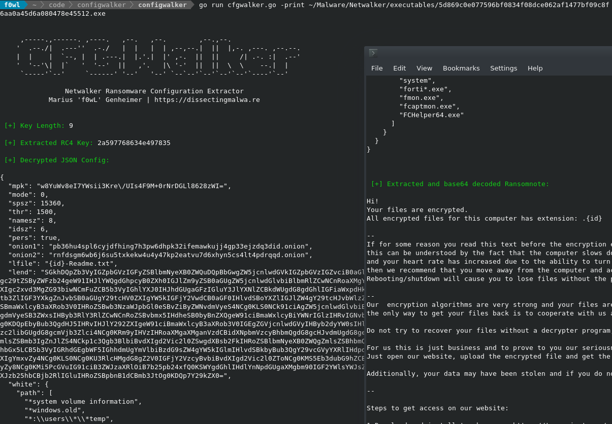
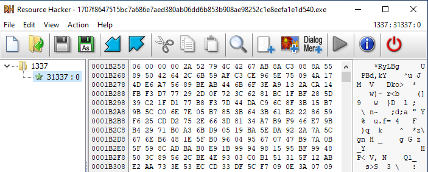
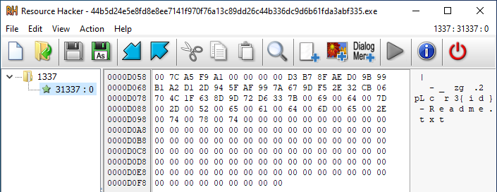
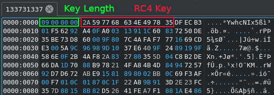

# configwalker

Configwalker is a configuration extractor for Netwalker Ransomware. It is capable of decrypting the RC4 encrypted Resource File and extracting the Ransomnote template. By default it will dump the results to disk, but you can also choose to print the config to stdout only by appending ```--print``` to the command.

## Usage

```go run path/to/sample.exe [--print]```

<br>

## Screenshots

<p align="center">
  
</p>


<br>

## Configuration contents

The table below shows the keys used in the JSON configuration of Netwalker Ransomware. 

| Key  | Value / Purpose |
|:----:|:---------------:|
| mpk  | Base64 encoded Public Key|
| mode | Presumably related to the encryption process |
| spsz | Chunk size for encryption |
| thr | Threading limit |
| namesz | Length of the random name for the persistent executable |
| idsz | Length of the random file extension |
| pers | Presumably related to target / victim type |
| mail | Contact e-Mail addresses |
| onion1 | Main TOR site |
| onion2 | Backup TOR site |
| lfile | Template string for the ransomnote filename |
| lend | Base64 encoded ransomnote template |
| white{path[ ]} | Whitelist for system directories |
| white{file[ ]} | Whitelist for system files |
| white{ext[ ]} | Whitelist for file extensions |
| kill{use:bool} | Switch to kill specified processes or not |
| kill{prc[ ]} | List of process names to be terminated |
| kill{svc[ ]} | List of services to be terminated |
| kill{svcwait:int} | Timeout before terminating a service |
| kill{task[ ]} | Task after successful encryption |
| net{use:bool} | Switch encryption of mapped (network) drives on/off |
| net{ignore{use:bool}} | Use of Whitelists for drive Encryption |
| net{ignore{disk:bool}} | Encrypt mounted disks |
| net{ignore{share[ ]}} | Whitelisted shares |
| unlocker{use:bool} | Presumably enables decryption capabilities |
| unlocker{ignore{use:bool}} | Use Ignorelist during decryption |
| unlocker{ignore{pspath[ ]}} | Process Paths to ignore |
| unlocker{ignore{prc[ ]}} | Processes to ignore |

<br>

## Background Info

Not all samples of Netwalker Ransomware will contain a full configuration file. Below you can see two screenshots of Resource Hacker, one with an long encrypted config and one with a short plaintext config. This tool only works for the former format.

<p align="center">
  
</p>

<p align="center">
  
</p>

<br>

The first 4 bytes of the resource contain the length of the following RC4 Key. This value changes from sample to sample. With this information it is easy to extract the key and decrypt the rest of the resource.

<p align="center">
  
</p>

<br>

## Testing

The tool has been confirmed to successfully extract the configuration from the following samples identifiable by their SHA-256 hashsums. If you encounter an error with configwalker please file a bug report as an issue. On some occasions the Netwalker config files contain malformed json objects (fix WIP).

| SHA-256 Hashsums|
|:---------------:| 
| 1707f8647515bc7a686e7aed380ab06dd6b853b908ae98252c1e8eefa1e1d540 |
| 5d869c0e077596bf0834f08dce062af1477bf09c8f6aa0a45d6a080478e45512 |
| 46dbb7709411b1429233e0d8d33a02cccd54005a2b4015dcfa8a890252177df9 |
| 4f7bdda79e389d6660fca8e2a90a175307a7f615fa7673b10ee820d9300b5c60 |
| 27319e75c23693399977e92b9a7ba5680a7a9db448f93b3221840c61301604d5 |
